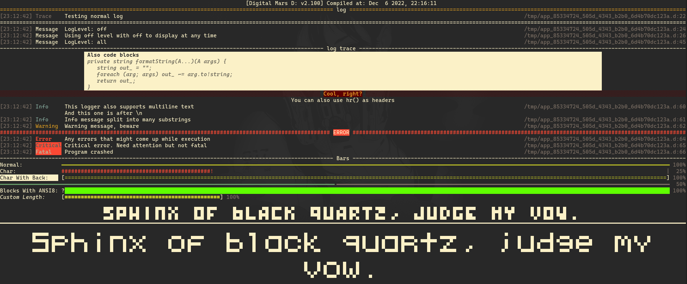
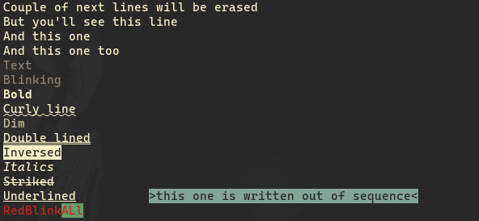
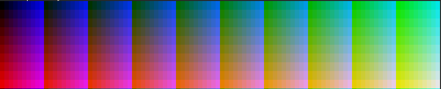

# sily-terminal
Terminal utils, TUI, bash escape sequences

## Modules

* sily.logger - Print pretty logs
* sily.terminal - Terminal/Bash utils
* sily.tui - Terminal UI made easy

## Logger

### sily.logger:
* `log`: Prints nice message using full terminal width. Can be set to display Message (not affected by global log level), Trace, Info, Warning, Error, Critical and Fatal messages. Also global log level can be set which will prevent some of messages from showing
* `hr`: Prints long horizontal line and if message is set then puts text in middle of line 
* `block`: Prints code block with title
* `center`: Prints message in center of screen
* `printCompilerInfo`: Prints compiler info in form of `[Compiler: Ver] Compiled at: Date`
* `progress`: Print progress bars configured with ProgressBar struct. Must be manually erased (possibly by using `eraseLines(NUM);` from `sily.bashfmt`)
### sily.logger.pixelfont:
Contains two pixel fonts. Not recommended for continious use.
* `print5x6`: Prints text in 5x6 pixel font using unicode characters
* `get5x6`: Gets text in 5x6 font as string
* `print3x4`: Prints text in 3x4 pixel font using unicode characters
* `get3x4`: Gets text in 3x4 font as string

## sily.terminal
* `sily.bashfmt`: Contains almost all vt200/xterm bash formatting/cursor/screen sequences

* `sily.terminal`: Utils to get info about terminal or manipulate iostream

